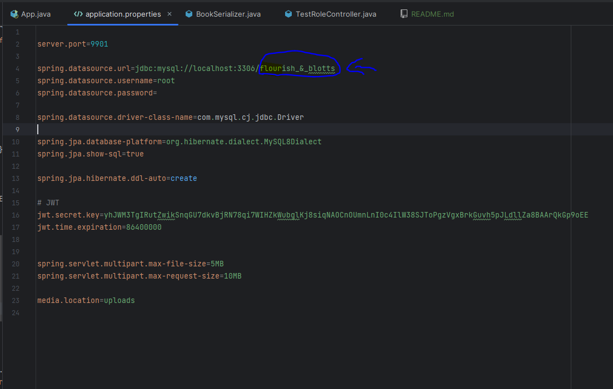

# Flourish and  Blotts
***

This project simulates a high school library where you can loan a book if you are a student of the school. 
It's made with Spring Boot and Angular, so it's made with API services. The application have the jwt authentication
and roles system giving permissions some users with diferent scopes.

## To set up
***
This application is made with Spring boot 3 and version 20 of Java. It uses MySQL for the DB 
administration and uses maven for the packages installation. 

To set up the project you need and Java compiler. You have to install Maven.

To set the database you have to create one and put the name in the application.properties file
in the section that showing in the image:



And to execute the app, type this command in the CMD:

````
mvn spring-boot:start
````
The app works with the Angular project in this [link](https://github.com/DenisLazarian/Flourish_And_Blotts-FrontEnd).

If you want to run the Angular project, type this command:
````
ng serve
````

## Demo
***
Available users in the app.
```
Available users and password:
- user@me.local         1234
- responsible@me.local  1234
- admin@me.local        1234
```

## Disclaimer
***
This project is for educational purposes only. I am not responsible for any misuse or damage caused by this program. Use it at your own risk.

## License
***
Copyright (c) 2023 The Denis Lazarian

Permission is hereby granted, free of charge, to any person obtaining a copy
of this software and associated documentation files (the "Software"), to deal
in the Software without restriction, including without limitation the rights
to use, copy, modify, merge, publish, distribute, sublicense, and/or sell
copies of the Software, and to permit persons to whom the Software is
furnished to do so, subject to the following conditions:

The above copyright notice and this permission notice shall be included in
all copies or substantial portions of the Software.

THE SOFTWARE IS PROVIDED "AS IS", WITHOUT WARRANTY OF ANY KIND, EXPRESS OR
IMPLIED, INCLUDING BUT NOT LIMITED TO THE WARRANTIES OF MERCHANTABILITY,
FITNESS FOR A PARTICULAR PURPOSE AND NONINFRINGEMENT. IN NO EVENT SHALL THE
AUTHORS OR COPYRIGHT HOLDERS BE LIABLE FOR ANY CLAIM, DAMAGES OR OTHER
LIABILITY, WHETHER IN AN ACTION OF CONTRACT, TORT OR OTHERWISE, ARISING FROM,
OUT OF OR IN CONNECTION WITH THE SOFTWARE OR THE USE OR OTHER DEALINGS IN
THE SOFTWARE.